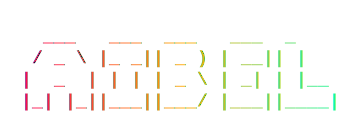

<!-- Header -->
<p align="center">
  
</p>

# `< AIBEL S ANICKAL />`

### ⚡ Full-Stack Developer · UI/UX Designer · Web Craftsman ⚡

[](https://git.io/typing-svg)

</div>

---

<!-- About -->
## 👾 `ABOUT.ME`

```javascript
const aibel = {
  name:     "Aibel S Anickal",
  role:     ["Frontend Developer", "Backend Developer", "UI/UX Designer"],
  location: "Kerala, India 🇮🇳",
  skills:   ["React", "Node.js", "JavaScript", "TypeScript", "CSS", "UI/UX"],
  status:   "🟢 Available for work",
  motto:    "Level up your web, one commit at a time 🕹️"
};
```

---

<!-- Skills -->
## 🛠️ `SKILL_TREE.EXE`

<div align="center">

### Frontend


### Backend


### Design & Tools


</div>

---

<!-- GitHub Stats -->
## 📊 `GITHUB_STATS.LOG`

<div align="center">


</div>

<div align="center">


</div>

---

<!-- Activity Graph -->
## 📈 `COMMIT_GRAPH`

<div align="center">

[](https://github.com/AIBELSANICKAL)

</div>

---

<!-- Trophy -->
## 🏆 `ACHIEVEMENTS.DAT`

<div align="center">

[](https://github.com/AIBELSANICKAL)

</div>

---

<!-- Connect -->
## 🔗 `CONNECT.SH`

<div align="center">

[](https://www.linkedin.com/in/aibel-s-anickal-196715326/?skipRedirect=true)
[](https://AIBELSANICKAL.dev)
[](mailto:aibelsanickal2006@gmail.com)
[](https://github.com/AIBELSANICKAL)

</div>

---

<!-- Footer -->
<div align="center">

```
░░░░░░░░░░░░░░░░░░░░░░░░░░░░░░░░░░░░░░░░░░░░░░░░░
░  MADE WITH ♥ + TOO MUCH COFFEE · KERALA, INDIA  ░
░        ▶ INSERT COIN TO VIEW MORE PROJECTS ◀     ░
░░░░░░░░░░░░░░░░░░░░░░░░░░░░░░░░░░░░░░░░░░░░░░░░░
```


</div>
